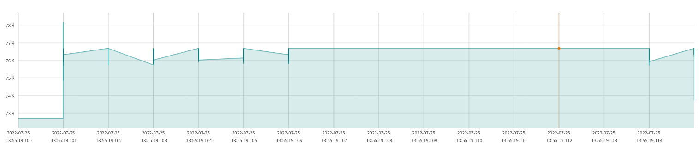

This shows the difference in allocations when you define something in cpp vs in header file.
There is a map in info_data.h
```
const std::map<EType, std::map<std::string, std::string>> huge_map = {...}
```

Including this file in many cpp-s results in big memory usage, but when this map is moved to the cpp file (info_data.cpp) then the memory usage is much smaller. You can see the big difference (~480K vs 80K).

By moving this map to the cpp file I mean that the
```
const std::map<EType, std::map<std::string, std::string>> huge_map = {...}
```
is not even declared in info_data.hpp - whole part of this code is moved to the info_data.cpp

#### when map is defined in header:


#### when map is defined in cpp:



#### when map is defined in header:


#### when map is defined in cpp:


#### when map is defined in header:


#### when map is defined in cpp:


### Building:
CmakeLists.txt, main.cpp and UserX.cpp, UserX.hpp are generated by users_generator.py
In users_generator.py you can define how many X will be created.
After running users_generator.py you can build binary with cmake and make.
In this repo I committed generated files with X=2 but tests were run on X=200.

### Analysis
Symbols diff on 2 binaries (definition in hpp vs in cpp) is there:
https://www.diffchecker.com/wyHn7X2e
Inputs to diffs were generated with command:
```
nm static_initialization_in_headers | grep "_Z.*" -o | c++filt | sort &> names.txt
```

adding static does not make difference

### How I measured it?
Using https://github.com/koute/bytehound

and using heaptrack https://github.com/KDE/heaptrack
